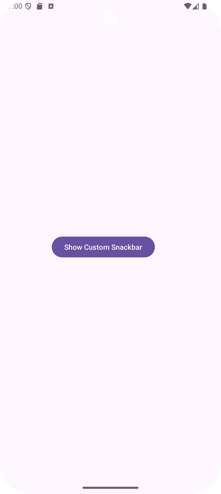

# Custom Snackbar Demo

Bu proje, Android uygulamalarında özel bir Snackbar oluşturmak için bir demo uygulamasıdır. Uygulama, kullanıcı dostu bir arayüzle özelleştirilmiş Snackbar bildirimleri göstermeyi amaçlar.

## 📸 Ekran Görüntüleri
<table>
    <tr>
        <td align="center">
            <strong><h2>Main</h2></strong>
            
        </td>
        <td align="center">
            <strong><h2>Snackbar</h2></strong>
            
        </td>
    </tr>
    <table>

## ✨ Uygulama Özellikleri

- 📝 **Özel Snackbar:** Kullanıcıların özel tasarlanmış Snackbar'lar ile bildirim almasını sağlar.
- 🎨 **Özelleştirilebilir Tema:** Snackbar görünümünü özelleştirmek için arka plan ve ikon renklerini ayarlama imkanı.
- 📱 **Kullanıcı Dostu Arayüz:** Modern ve sezgisel bir tasarım.
- 🔄 **Dinamik Mesaj Gösterimi:** Kullanıcı etkileşimlerine göre farklı mesajlar gösterebilir.

## :pencil2: Kurulum Talimatları

Projeyi bilgisayarınıza klonlamak için aşağıdaki komutu kullanın:

```bash
git clone https://github.com/oktayGnc/CustomSnackbarDemo
```

## Gereksinimler
- Android Studio
- Kotlin 1.5 veya üstü
- Android SDK 35
